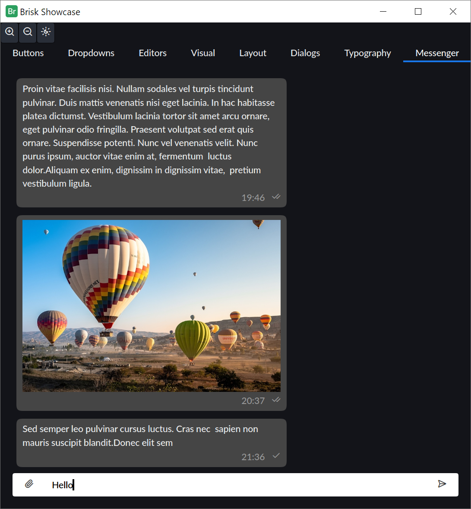
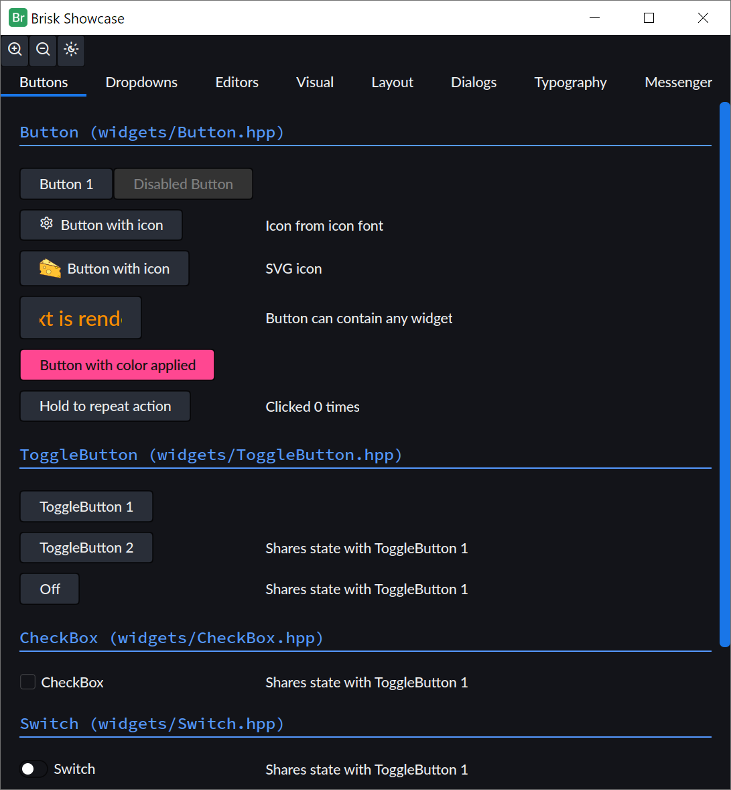
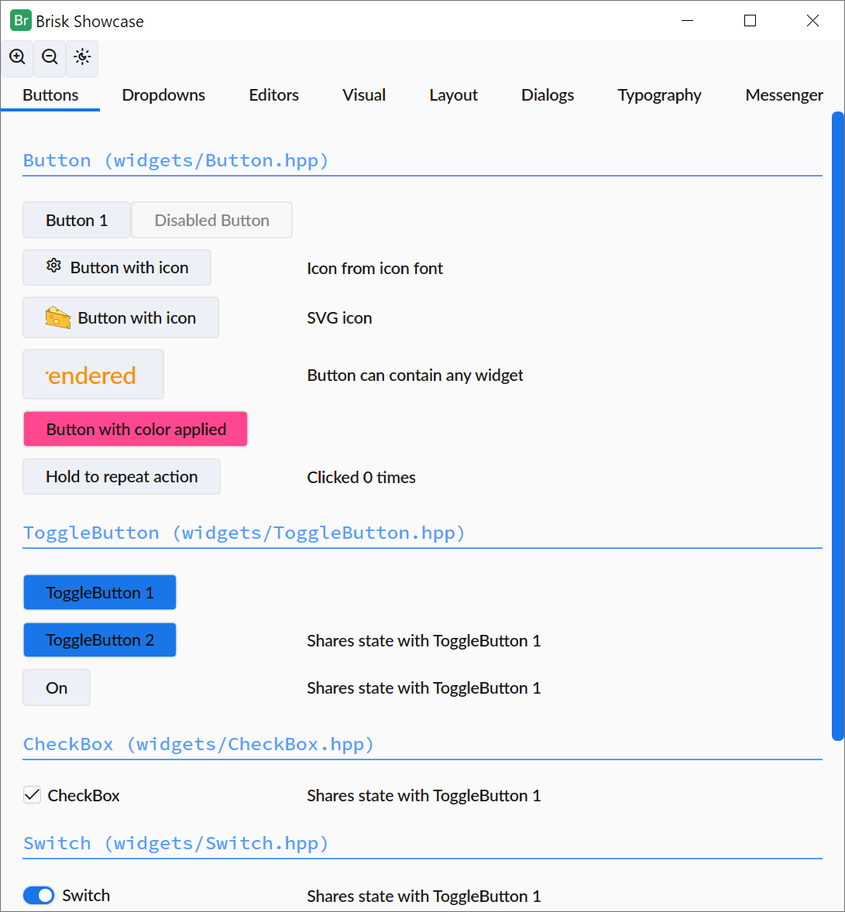

# Brisk

Brisk is a modern, cross-platform C++ GUI toolkit focused on building responsive, high-performance applications with flexibility and ease.

🚧 The Brisk library is currently under active development and will remain in the Alpha stage for the next few releases. After that, it will transition to Beta. During this period, expect breaking changes and incomplete documentation

### Key Features 🌟
- **Stateful & Stateless Widgets**: Supports both modes with flexible binding for efficient state management.
- **Hardware-Accelerated Graphics**: Backends include D3D11, D3D12, Vulkan, OpenGL, Metal, and WebGPU.
- **Color Processing**: Supports linear color and gamma-naïve processing for wide compatibility.
- **Unicode Support**: Full UTF-8/16/32 support, including RTL text rendering and basic localization.
- **Modular Architecture**: Core, Graphics, Window, GUI, and Widgets modules for versatile application development.

### Screenshots

  

### Modules

#### **Core**
   - **Compression & Basic Cryptography**: Provides data compression and basic cryptographic functions, including hashing algorithms.
   - **Dynamic Library Loading**: Loads and interacts with `.dll` or `.so` files dynamically.
   - **String Manipulation**: Handles UTF-8, UTF-16, and UTF-32, with text manipulation utilities.
   - **Stream I/O**: Input/output operations for handling data streams.
   - **Localization Support**: Basic localization and internationalization features for multilingual applications.
   - **Logging**: Built-in logging framework for application diagnostics.
   - **Reflection**: Supports reflection.
   - **Serialization**: Serializes/deserializes data to/from JSON.
   - **App-Global Settings**: Manages global application settings.
   - **Threading**: Provides task queues for multi-threaded applications.
   - **Binding**: Supports value binding, capable of handling multi-threaded environments.

#### **Graphics**
   - **Color & Colorspaces**: Supports working with colors, including various colorspaces.
   - **Geometry**: Provides 2D geometry types like `Rect`, `Point`, `Size`, and 2D matrices for transformations.
   - **Canvas & Path**: Supports drawing with paths and Bézier curves.
   - **SVG Rasterization**: Renders SVG images into raster formats.
   - **Image Processing**: Supports image encoding, decoding, resizing, and manipulation.
   - **Font Handling**: Manages fonts, including loading, rendering, caching, and text layout. Supports advanced text shaping (using HarfBuzz).

#### **Window**
   - **Clipboard**: Provides clipboard access for copy/paste functionality.
   - **OS Dialogs**: Native dialogs for file open/save, folder selection, and message boxes.
   - **Display Information**: Retrieves and manages display/monitor information from the OS.

#### **GUI**
   - **Widgets**: Includes a wide variety of widgets with CSS-style flex layout.
   - **Style Sheets**: Styles your widgets using a stylesheet system that supports property inheritance.
   - **Binding Support**: Data-binding between UI elements and application data. Supports transforming values using a function on-the-fly and compound values (e.g., sums of other values).
   - **Stateful and Stateless Modes**: Choose between stateful widgets for persistent state or stateless widgets for easily rebuilding widget subtrees.

#### **Widgets**
   - **Widgets**: Includes buttons, lists, comboboxes, toggle switches, radio buttons, progress bars, sliders, scroll boxes, checkboxes, popup buttons, tabs, tables, spin boxes, dialogs, and more. All public properties are styleable and bindable.
   - **Layouts**: Supports CSS flexbox-style layouts.
   - **Text Editors**: Provides text editing widgets with LTR and RTL text support.

### Requirements ⚙️
- **C++20 Compiler**: Brisk requires a C++20-compatible compiler such as MSVC 2022, Clang, XCode, or GCC.
- **Dependency Management**: Uses [vcpkg](https://github.com/microsoft/vcpkg) to manage dependencies across platforms, simplifying the build process.

### Platform Support

|                     | Windows | macOS | Linux |
|---------------------|---------|-------|-------|
| Core Functionality  | Beta    | Beta  | Beta  |
| Graphics            | Beta    | Beta  | Beta  |
| Window System       | Alpha   | Alpha | Alpha |
| Widgets             | Beta    | Beta  | Beta  |
| Application Support | Alpha   | Alpha | N/A   |

#### OS Support

|         | Minimum version                 |
|---------|---------------------------------|
| Windows | Windows 10, Windows Server 2016 |
| macOS   | macOS 11 Big Sur                |
| Linux   | n/a                             |

### Graphics Backend Support

|         | Backends                        |
|---------|---------------------------------|
| Windows | D3D11 and WebGPU (D3D12/Vulkan) |
| macOS   | WebGPU (Metal)                  |
| Linux   | WebGPU (OpenGL/Vulkan)          |

### Development 💻

Brisk is in active development, and we welcome contributions and feedback from the community to improve and expand the toolkit.

The `main` branch contains the latest features and generally passes all built-in tests ✅.

### License 📜
Brisk is licensed under the **GPL v2.0** or later. However, for those who wish to use Brisk in proprietary or closed-source applications, a **commercial license** is also available. For more details on commercial licensing, please contact us at [brisk@brisklib.com](mailto:brisk@brisklib.com).
